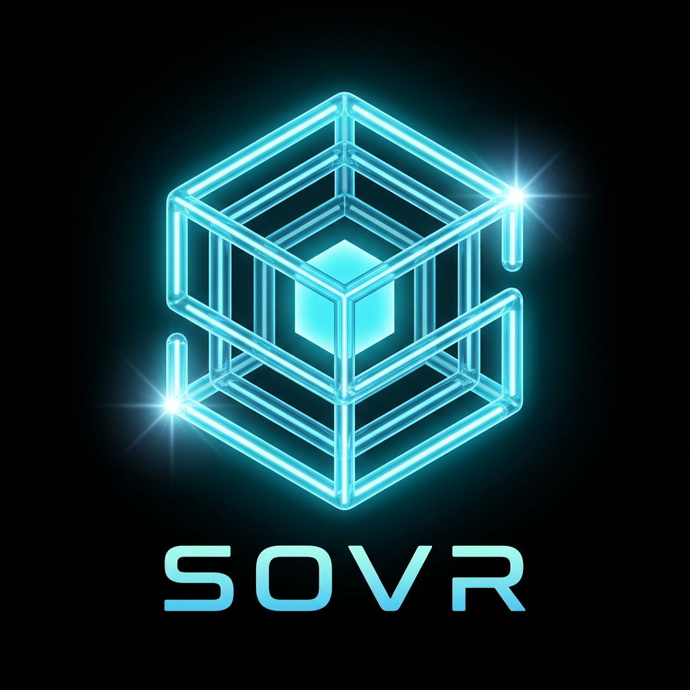

<div align="center">

  

  <h1>SOVR EMPIRE</h1>

  <h3>AI Solutions Architecture · Financial Infrastructure · Web3 Protocol Engineering</h3>

  <p>
    <strong>Engineering sovereign financial infrastructure from protocol definition to execution.</strong>
  </p>

  <p>
    SOVR is an experimental financial operating system built around
    <strong>deterministic protocol compilation</strong>,
    <strong>event-driven execution</strong>,
    <strong>cryptographic integrity</strong>,
    <strong>programmable financial workflows</strong>,
    and <strong>ledger-backed state</strong>.
  </p>

  <br>

  <a href="https://sovr.world">
    
  </a>
  
  
  
  

</div>

---

# AI Solutions Architect & Infrastructure Engineer

**Gustavo Orona Maldonado**

Founder of **SOVR Empire**

I design and build systems where complex business rules, financial workflows, trust boundaries, and protocol specifications become **executable infrastructure**.

My work sits at the intersection of:

- AI-native software engineering
- Infrastructure architecture
- Web3 protocol engineering
- Financial operating systems
- Distributed ledger architecture
- Event-driven systems
- Deterministic compilation
- Authorization and trust systems
- Full-stack application development
- Real-time payment infrastructure

The objective is simple:

> **Turn complex systems into software that can be compiled, executed, verified, and trusted.**

---

# SOVR

SOVR is an evolving **financial infrastructure and protocol engineering platform** designed around a simple architectural principle:

```text
Protocol Definition
        ↓
Deterministic Compiler
        ↓
Canonical Intermediate Representation
        ↓
Compiled Registries
        ↓
Authority Loader
        ↓
Kernel Executor
        ↓
Event Store
        ↓
State Reconstruction
        ↓
Projection Layer
        ↓
External Financial Infrastructure
